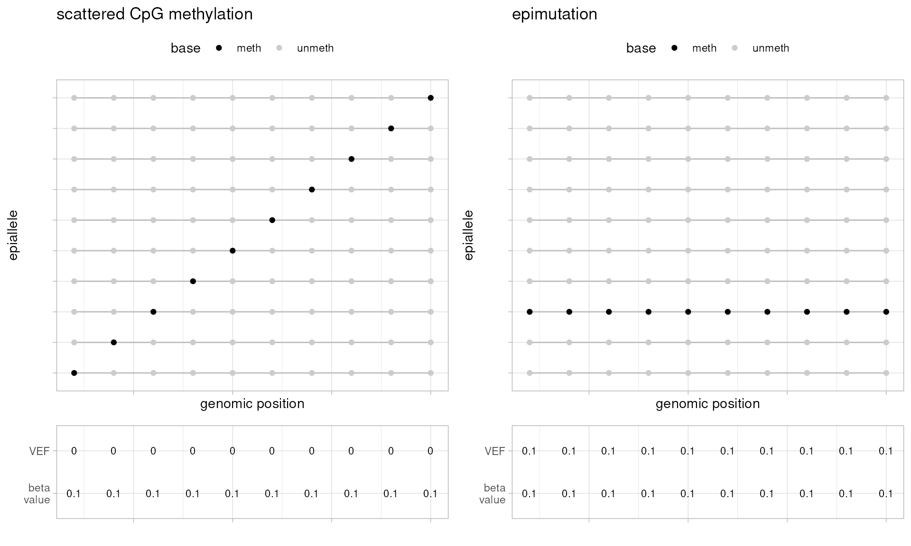
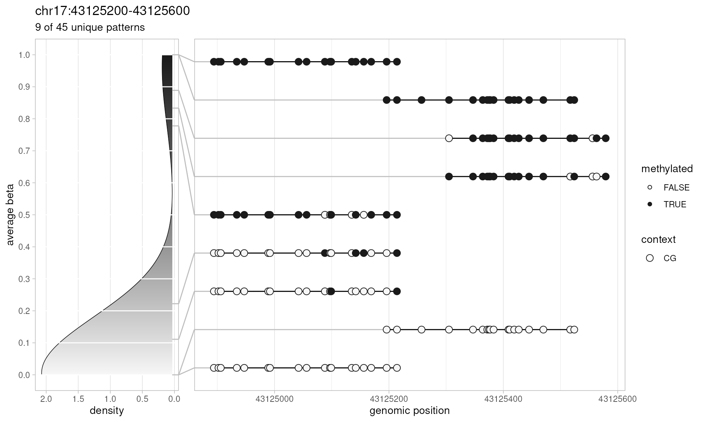
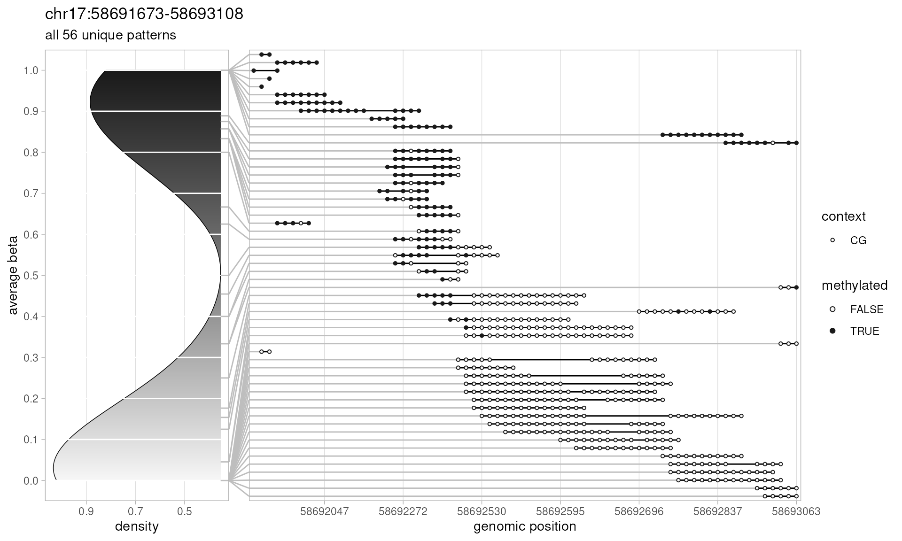
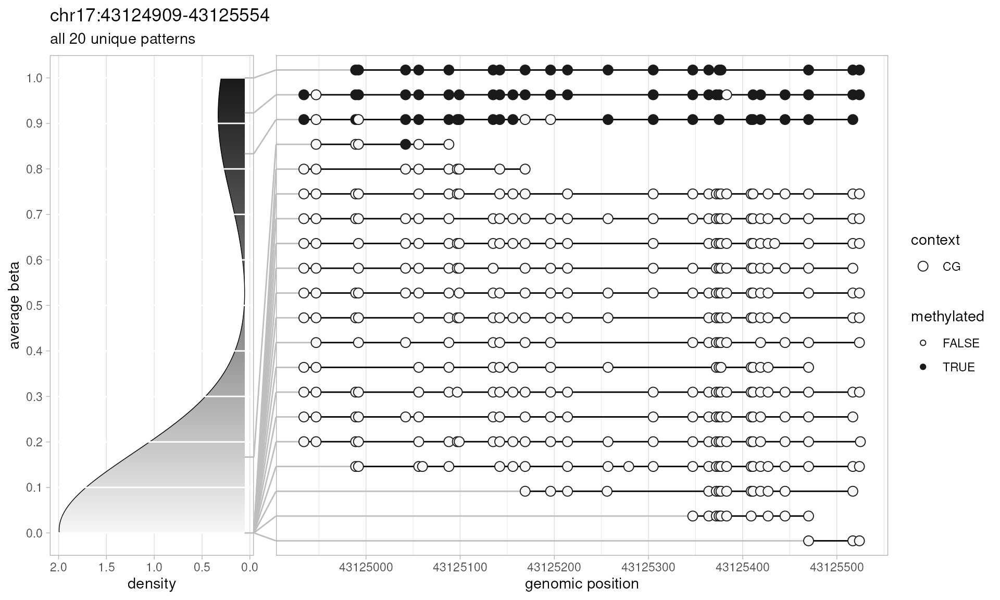
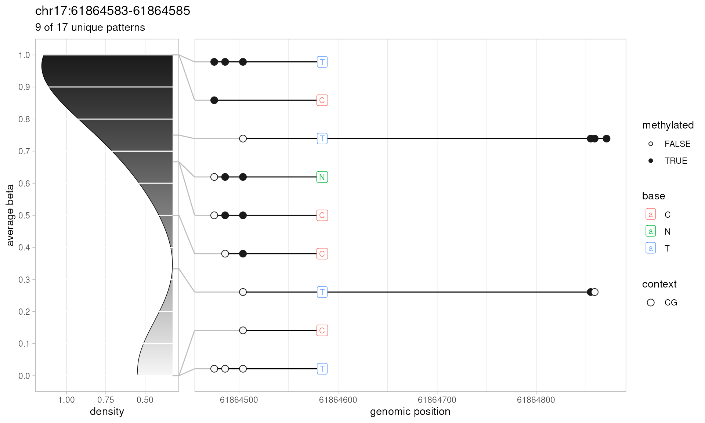
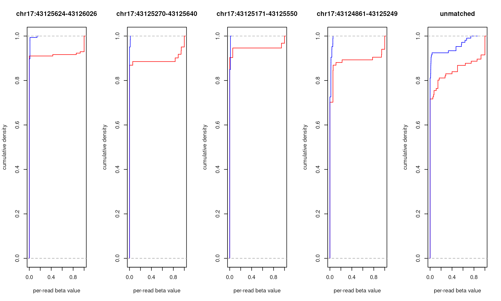
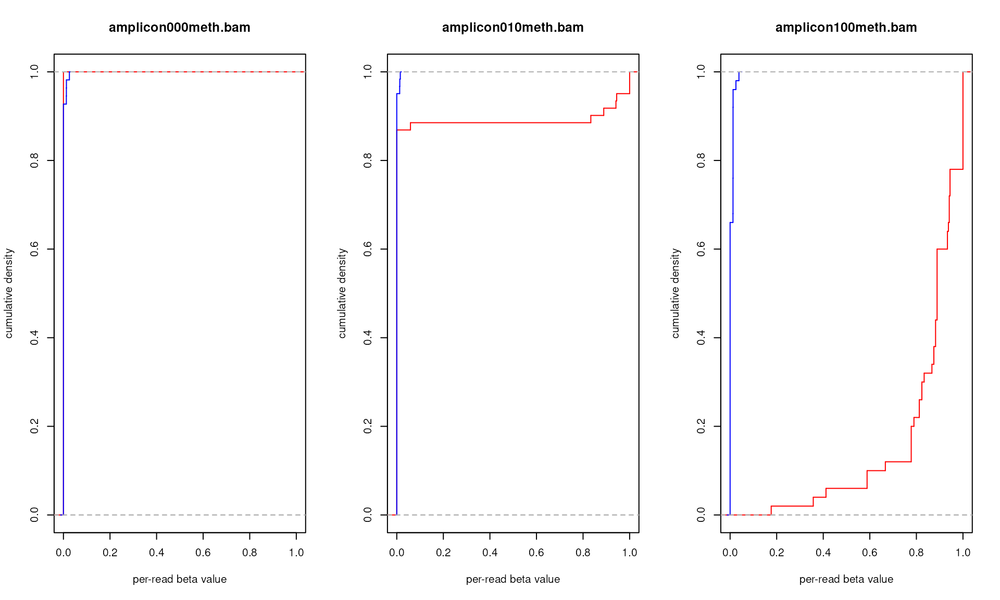

# The epialleleR User's Guide

Abstract

A comprehensive guide to using the epialleleR package for analysis of
next-generation sequencing data

------------------------------------------------------------------------

## Introduction

Cytosine DNA methylation is an important epigenetic mechanism for
regulation of gene expression. Abnormal methylation is linked to several
diseases, being for example the most common molecular lesion in cancer
cell.[^1] Multiple studies suggest that alterations in DNA methylation,
despite occurring at a low mosaic level, may confer increased risk of
cancer later in life.[^2]

Cytosine methylation levels within relatively narrow regions of the
human genome are thought to be often concordant, resulting in a limited
number of distinct methylation patterns of short sequencing reads.[^3]
Due to the cell-to-cell variations in methylation, DNA purified from
tissue samples contains a mix of hyper- and hypomethylated alleles with
varying ratios that depend on the genomic region and tissue type.

Unsurprisingly, when the frequencies of hypermethylated epialleles are
low (e.g. 1e-02 and lower) and cytosine methylation levels are averaged
and reported using conventional algorithms, the identification of such
hypermethylated epialleles becomes nearly impossible. In order to
increase the sensitivity of DNA methylation analysis we have developed
*`epialleleR`* — an R package for calling hypermethylated variant
epiallele frequencies (VEF).

Two edge cases epialleleR was designed to distinguish are presented
below (more examples can be found
[here](https://bbcg.github.io/epialleleR/articles/values.html)). While
these are simplified and entirely artificial, they still give an idea of
two different methylation patterns that may exist in real life, be
characterised by very similar quantitative metrics (beta value, the
ratio of methylated cytosines, \\C\\, to total number of cytosines,
\\C+T\\, per genomic position, i.e. \\\beta = \frac{C}{C+T}\\), but have
entirely different biological properties: non-functional scattered
methylation / technical artefacts on the left, and epigenetic gene
inactivation on the right. VEF values, that are essentially the ratio of
methylated cytosines in hypermethylated (**a**bove threshold) reads,
\\C^a\\, to total number of cytosines, \\C+T\\, per genomic position,
i.e. \\VEF = \frac{C^a}{C+T}\\, clearly separate these cases and are
thought to be more useful in detection and quantification of concordant
methylation events.



*`epialleleR`* is a very fast, accurate, and scalable solution for
analysis of data obtained by next-generation methylation/native
sequencing of DNA samples. The minimum requirement for the input is a
Binary Alignment Map (BAM) file containing sequencing reads.
*`epialleleR`* works equally well with shallow, deep or even ultra-deep
sequencing data, obtained using narrowly targeted gene panels (amplicon
sequencing), larger methylation capture panels, or even whole-genome
approaches.

### Current Features

- If methylation calls are not present in BAM file, *`epialleleR`* can
  make and store such calls in output BAM (similar to Bismark or
  Illumina’s mapping/alignment solutions; short-read sequencing
  alignments only)
- *`epialleleR`* can create and store sample BAM files for testing
  purposes by means of *`simulateBam`* method
- In addition to conventional reporting of cytosine DNA methylation
  levels (beta values), *`epialleleR`* can call variant epiallele
  frequencies (VEF) of hypermethylated alleles at the level of
  individual cytosines (*`generateCytosineReport`*) or supplied genomic
  regions (*`generateBedReport`*)
- Linearised Methylated Haplotype Load (lMHL, *`generateMhlReport`*) can
  be used instead of VEF when thresholding is not recommended (long-read
  sequencing)
- DNA methylation patterns of genomic region of interest can be explored
  using *`extractPatterns`* and *`plotPatterns`*
- The association of methylation with single-nucleotide variations
  within epialleles can be tested using *`generateVcfReport`*
- Potential bimodality of methylation for genomic regions of interest
  can be assessed using *`generateBedEcdf`* method

### Processing speed

Currently *`epialleleR`* runs in a single-thread mode only.
Reading/writing of BAM and FASTA data is now done by means of
*`HTSlib`*, therefore it is possible to speed it up significantly using
additional decompression threads (*`nthreads`* option in *`epialleleR`*
methods). All operations are performed using optimised C++ functions,
and usually take reasonable time.

During methylation calling, human genome (hg38) loading usually takes
10-15 seconds. Using preloaded reference genome, the calling itself is
performed at the speed of 200-300 thousand short reads (150 or 225 bases
long) per second (25-40 MB/s of BAM data).

During methylation reporting, running time for complete task “BAM on
disk -\> CX report on disk” depends on the size of the BAM file, and the
speed is usually within the range of 30-50 MB/s (or 250-400 thousand
short reads per second) for a single core of a relatively modern CPU
(Intel(R) Core(TM) i7-7700).

Major bottlenecks (in BAM loading and preprocessing) were removed in the
release v1.2, full multithreading and minor improvements are expected in
the future.

### Reference-free processing

Unlike many other tools for methylation/modification reporting,
*`epialleleR`* does not require reference (genome) sequence for the
majority of analyses (all but methylation calling for short-read
methylation sequencing data, where it is absolutely necessary). Cytosine
methylation and its genomic context for both short-read and long-read
data are reported based on what is actually observed in sequencing
reads. The consequences (benefits and drawbacks) of that are as follows:

- the reported numbers of modified and unmodified bases may differ from
  the output of other tools — although there is a noticeable inter-tool
  disagreement even for the tools that use reference genome sequence
- there might occur *de novo* cytosines and/or *de novo* genomic
  contexts as a result of, e.g., single-nucleotide variation or small
  indels — they are reported as long as they are observed in a majority
  of reads covering that position
- the potential drawback of slow processing is nivellated by very
  efficient C/C++ code — even in a single-threaded mode, *`epialleleR`*
  reports cytosine methylation not slower (often much faster) than,
  e.g., Bismark, Illumina DRAGEN, or Oxford Nanopore Technologies Modkit
- small but noticeable increase in the accuracy of reported methylation
  (see *`epialleleR`* publication) — which in case of the paired-end
  short-read data may be attributed not only to reference-free
  processing but also to quality-based read merging. When tested on a
  5mC subset of Modkit validation data
  (`s3://ont-open-data/modbase-validation_2024.10/`), methylation
  frequencies (beta values) reported by *`epialleleR`* were closer to
  the ground truth frequencies than the ones reported by Modkit, using
  the very same modification probability cutoffs (automatically
  determined by Modkit)

&nbsp;

    # long-read input data from s3://ont-open-data/modbase-validation_2024.10/
    # explained at https://epi2me.nanoporetech.com/mod-validation-data/

    # summarise methylation using Modkit

    $ modkit pileup "5mC_rep1.bam" "5mC_rep1.cx.bedMethyl" -s 8 -t 8 --modified-bases 5mC --reference "all_5mers.fa"
    > discarded 0 contigs with zero aligned reads
    > parsed 1 base modification(s). Base modifictions other than 'C:m' will be counted as 'N_other'.
    > adding single-base motif: 'C 0'
    > attempting to sample 10042 reads
    > Threshold of 0.66796875 for base C is low. Consider increasing the filter-percentile or specifying a higher threshold.
    > Threshold of 0.6699219 for base A is low. Consider increasing the filter-percentile or specifying a higher threshold.
    > using optimized workers for A,C all-context
    > Done, processed 1537 rows.

    $ modkit pileup "5mC_rep2.bam" "5mC_rep2.cx.bedMethyl" -s 8 -t 8 --modified-bases 5mC --reference "all_5mers.fa"
    > discarded 0 contigs with zero aligned reads
    > parsed 1 base modification(s). Base modifictions other than 'C:m' will be counted as 'N_other'.
    > adding single-base motif: 'C 0'
    > attempting to sample 10042 reads
    > Threshold of 0.67578125 for base C is low. Consider increasing the filter-percentile or specifying a higher threshold.
    > Threshold of 0.6738281 for base A is low. Consider increasing the filter-percentile or specifying a higher threshold.
    > using optimized workers for A,C all-context
    > Done, processed 1624 rows.

    # compare in R

    library(epialleleR)
    library(data.table)

    # summarize cytosine methylation using epialleleR with Modkit's thresholds
    generateCytosineReport(
      bam="5mC_rep1.bam", report.file="5mC_rep1.cx.tsv",
      threshold.reads=FALSE, filter.reads=FALSE, cytosine.context="CX", report.context="CX",
      min.mapq=0, min.baseq=0, min.prob=round(256*0.66796875), nthreads=4
    )
    generateCytosineReport(
      bam="5mC_rep2.bam", report.file="5mC_rep2.cx.tsv",
      threshold.reads=FALSE, filter.reads=FALSE, cytosine.context="CX", report.context="CX",
      min.mapq=0, min.baseq=0, min.prob=round(256*0.67578125), nthreads=4
    )

    # load methylation summaries: true positive sites with methylation, by epialleleR, by Modkit
    dt.tp <- fread("all_5mers_5mC_sites.bed", col.names=c("rname", "V2", "pos", "V4", "V5", "strand"))
    dt.epi <- rbindlist(lapply(list(rep1="5mC_rep1.cx.tsv", rep2="5mC_rep2.cx.tsv"), fread), idcol="rep")
    dt.modkit <- rbindlist(lapply(list(rep1="5mC_rep1.cx.bedMethyl", rep2="5mC_rep2.cx.bedMethyl"), fread,
                                  col.names=c("rname", "V2", "pos", "V4", "cov", "strand", "V7", "V8", "V9",
                                              "V10", "V11", "meth", "V13", "V14", "V15", "V16", "V17", "V18")), idcol="rep")
    # combine all
    dt.all <- merge.data.table(
      merge.data.table(
        dt.epi[, .(rep, rname, pos, strand, context, meth.epi=meth, cov.epi=meth+unmeth, beta.epi=meth/(meth+unmeth))],
        dt.modkit[, .(rep, rname, pos, strand, meth.modkit=meth, cov.modkit=cov, beta.modkit=meth/cov)],
        by=c("rep", "rname", "pos", "strand"), all=TRUE
      ),
      dt.tp[, .(rname, pos, strand, TP=TRUE)], by=c("rname", "pos", "strand"), all=TRUE
    )

    # epialleleR beta values are higher for the majority of true positive sites
    dt.all[TP==TRUE, as.list(table(beta.epi>beta.modkit)), by=rep]
    #       rep FALSE  TRUE
    #    <char> <int> <int>
    # 1:   rep1    15   241
    # 2:   rep2    15   241

    # and are lower for the majority of true negative sites
    dt.all[is.na(TP), as.list(table(beta.epi<beta.modkit)), by=rep]
    #       rep FALSE  TRUE
    #    <char> <int> <int>
    # 1:   rep1   525   739
    # 2:   rep2   634   727

    # which then results in a slightly higher accuracy for epialleleR methylation reports
    lapply(list(epialleleR="epi", modkit="modkit"), function (tool) {
      TP <- as.numeric(sum(dt.all[TP==TRUE, get(paste0("meth.", tool))], na.rm=TRUE))
      TN <- as.numeric(sum(dt.all[is.na(TP), get(paste0("cov.", tool))-get(paste0("meth.", tool))], na.rm=TRUE))
      FP <- as.numeric(sum(dt.all[is.na(TP), get(paste0("meth.", tool))], na.rm=TRUE))
      FN <- as.numeric(sum(dt.all[TP==TRUE, get(paste0("cov.", tool))-get(paste0("meth.", tool))], na.rm=TRUE))
      ACC <- (TP+TN)/(TP+TN+FP+FN)
      MCC <- (TP*TN-FP*FN)/sqrt((TP+FP)*(TP+FN)*(TN+FP)*(TN+FN))
      c(accuracy=ACC, MCC=MCC)
    })
    # $epialleleR
    #  accuracy       MCC 
    # 0.9787987 0.9464980 
    # 
    # $modkit
    #  accuracy       MCC 
    # 0.9760796 0.9395759 

    # The accuracy is even higher when recommended values for mapping
    # and base quality are used (min.mapq=30, min.baseq=13)
    # $epialleleR
    #  accuracy       MCC 
    # 0.9868576 0.9669984 
    # 
    # $modkit
    #  accuracy       MCC 
    # 0.9760796 0.9395759 

------------------------------------------------------------------------

## Sample data

The *`epialleleR`* package includes sample data, which was obtained
using targeted sequencing. The description of assays and files is given
below. All the genomic coordinates for external data files are according
to GRCh38 reference assembly.

#### Amplicon-based methylation NGS data

The samples of Human HCT116 DKO Non-Methylated (Zymo Research, cat \#
D5014-1), or Human HCT116 DKO Methylated (Zymo Research, cat \# D5014-2)
DNA,[^4] or their mix were bisulfite-converted, and the BRCA1 gene
promoter region was amplified using four pairs of primers. Amplicons
were mixed, indexed and sequenced at Illumina MiSeq system. The related
files are:

| Name | Type | Description |
|----|----|----|
| amplicon000meth.bam | BAM | a subset of reads for non-methylated DNA sample |
| amplicon010meth.bam | BAM | a subset of reads for a 1:9 mix of methylated and non-methylated DNA samples |
| amplicon100meth.bam | BAM | a subset of reads for fully methylated DNA sample |
| amplicon.bed | BED | genomic coordinates of four amplicons covering promoter area of BRCA1 gene |
| amplicon.vcf.gz | VCF | a relevant subset of sequence variations |
| amplicon.vcf.gz.tbi | tabix | tabix file for the amplicon.vcf.gz |

#### Capture-based methylation NGS data

The tumour DNA was bisulfite-converted, fragmented and hybridized with
custom-made probes covering promoter regions of 283 tumour suppressor
genes (as described in [^5]). Libraries were sequenced using Illumina
MiSeq system. The related files are:

| Name               | Type  | Description                                   |
|--------------------|-------|-----------------------------------------------|
| capture.bam        | BAM   | a subset of reads                             |
| capture.bed        | BED   | genomic coordinates of capture target regions |
| capture.vcf.gz     | VCF   | a relevant subset of sequence variations      |
| capture.vcf.gz.tbi | tabix | tabix file for the capture.vcf.gz             |

#### Long-read native NGS data (adaptive sampling)

The blood DNA was fragmented, ligated with adapters, and sequenced using
Oxford Nanopore PromethION P2 Solo system. Base calling and CpG cytosine
modification analysis was performed in MinKNOW v25.09.16 using high
accuracy model v5.2.0. The file is:

| Name         | Type | Description                                    |
|--------------|------|------------------------------------------------|
| longread.bam | BAM  | a subset of reads covering BRCA1 promoter area |

#### Manually creating sample BAM files

For the purposes of testing this package’s methods or other tools for
methylation calling and/or reporting, *`epialleleR`* provides a
convenient way to manually create sample BAM files by specifying
mandatory and optional BAM file tags. The following code will create a
small BAM file that contains methylation calls and can be used for
methylation reporting as described later:

``` r

bam.file <- tempfile(pattern="simulated", fileext=".bam")
simulateBam(output.bam.file=bam.file, XM=c("ZZzZZ", "zzZzz"), XG="CT")
#> Writing sample BAM [0.007s]
#> [1] 2
# one can view the resulting file using `samtools view -h <bam.file>`
# or, if desired, file can be converted to SAM using `samtools view`,
# manually corrected and converted back to BAM
```

Check *`simulateBam`* method help page for more information on
parameters and their default values. More examples that use
*`simulateBam`* can also be found in help pages for `generate*Report`
functions.

------------------------------------------------------------------------

## Typical workflow

### Requirements

As mentioned earlier, *`epialleleR`* uses data stored in Binary
Alignment Map (BAM) files as its input and currently allows to load both
short-read (e.g., bisulfite or EM-seq) and long-read (native) sequencing
alignments. Specific requirements for these types of data are given
below. Additionally, please check the *`preprocessBam`* function help
file for a full description of available parameters, as well as
explanation of the function’s logic.

#### Short-read sequencing

It is a prerequisite that records in the BAM file contain an XG tag with
a genomic strand they map to (“CT” or “GA”), and an XM tag with the
methylation call string — such files are produced by mapping and
alignment tools such as Bismark Bisulfite Read Mapper and Methylation
Caller or state-of-the-art Illumina solutions: Illumina DRAGEN Bio-IT
Platform, Illumina Cloud analysis solutions, as well as contemporary
Illumina sequencing instruments with on-board read mapping/alignment
(NextSeq 1000/2000, NovaSeq X). These BAM files will contain all the
necessary information and can be analysed without additional steps.

If BAM files were produced by other mapping/alignment tools (e.g.,
bwa-meth or BSMAP) and lack XG/XM data, it is possible to call
methylation using *`callMethylation`* method. This method will add
absent XG/XM tags and save all data in the output BAM file that can be
further analysed by *`epialleleR`*.

#### Long-read sequencing

For preprocessing of long reads, *`epialleleR`* requires presence of MM
(Mm) and ML (Ml) tags that hold information on base modifications and
related probabilities, respectively. These are standard tags described
in SAM/BAM format specification, therefore relevant tools for analysis
and alignment of long sequencing reads should be able to produce them.

### Reading the data

All *`epialleleR`* methods can load BAM data using the file path.
However, if a file is very large and several reports need to be
prepared, it is advised to use the *`preprocessBam`* convenience
function as shown below. This function is also used internally when a
BAM file location string is supplied as an input for other
*`epialleleR`* methods.

*`preprocessBam`* automatically determines if BAM file contains paired-
or single-end alignments and has all the necessary tags (XM+XG, MM+ML)
available. It is recommended to use *`verbose`* processing and check
messages for correct identification of alignment endness. Otherwise, if
the *`paired`* parameter is set explicitly, exception (or warning if
*`override.check=TRUE`*) is thrown when expected endness differs from
the auto detected one.

During preprocessing of paired-end alignments, paired reads are merged
according to their base quality: nucleotide base with the highest value
in the QUAL string is taken, unless its quality is less than
*`min.baseq`*, which results in no information for that particular
position (“-”/“N”). These **merged reads** are then processed as a
**single entity** in all *`epialleleR`* methods. Due to merging,
overlapping bases in read pairs are counted only once, and the base with
the highest quality is taken.

It is currently a requirement that paired-end BAM file must be sorted by
QNAME instead of genomic location (i.e., “unsorted”) to perform merging
of paired-end reads. Error message is shown if it is sorted by genomic
location, in this case please sort it by QNAME using ‘samtools sort -n
-o out.bam in.bam’.

During preprocessing of single-end alignments, no read merging is
performed. Only bases with quality of at least *`min.baseq`* are
considered. Lower base quality results in no information for that
particular position (“-”/“N”).

For RRBS-like protocols, it is possible to trim alignments from one or
both ends. Trimming is performed during BAM loading and will therefore
influence results of all downstream *`epialleleR`* methods. Internally,
trimming is performed at the level of a template (i.e., read pair for
paired-end BAM or individual read for single-end BAM). This ensures that
only necessary parts (real ends of sequenced fragment) are removed for
paired-end sequencing reads.

It is also possible to load only a subset of reads (read pairs) of
interest or only fragments of such reads by supplying a list of targets
(see description of *`targets`* and other related options in the help
page for *`preprocessBam`* function). Currently, the subsetting is
performed without using BAM index.

#### Specific considerations for long-read sequencing data:

Any location not reported is implicitly assumed to contain no
modification.

According to SAM format specification, MM base modification tags are
allowed to list modifications observed not only on the original
sequenced strand (e.g., `C+m`) but also on the opposite strand (e.g.,
`G-m`). The logic of their processing is as follows (with the examples
given below): \* if an alignment record has no methylation modifications
(neither `C+m`, nor `G-m` are present), this record is, naturally,
considered to be a single read with no cytosines methylated \* if an
alignment record has `C+m` modification (base modifications on the
original sequenced strand), then this record is, naturally, considered
to be a single read with cytosine modifications on the sequenced strand
\* if an alignment record has `G-m` modification (base modifications on
the strand opposite to sequenced), then this record is treated as two
reads, with the original sequenced strand having no modifications, while
the opposite strand having cytosine modifications \* if both `C+m` and
`G-m` are present, then this record is treated as two reads, with both
strands having cytosine modifications

``` r

library(epialleleR)

# short-read sequencing
capture.bam <- system.file("extdata", "capture.bam", package="epialleleR")
capture.bed <- system.file("extdata", "capture.bed", package="epialleleR")
bam.data    <- preprocessBam(capture.bam, targets=capture.bed)
#> Checking BAM file: short-read, paired-end, name-sorted alignment detected
#> Reading BED file [0.033s]
#> Reading paired-end BAM file [0.017s]
generateCytosineReport(bam.data)
#> Filtering and thresholding reads [0.001s]
#> Preparing cytosine report [0.011s]
#>         rname strand       pos context  meth unmeth
#>        <fctr> <fctr>     <int>  <fctr> <int>  <int>
#>     1:   chr1      -   3067907      CG     1      0
#>     2:   chr1      -   3067912      CG     1      0
#>     3:   chr1      -   3067934      CG     1      0
#>     4:   chr1      -   3067962      CG     1      0
#>     5:   chr1      -   3067973      CG     1      0
#>    ---                                             
#> 15404:   chrX      + 136196775      CG     1      1
#> 15405:   chrX      - 136196776      CG     1      0
#> 15406:   chrX      + 136196793      CG     1      0
#> 15407:   chrX      - 136196794      CG     1      0
#> 15408:   chrX      + 136197192      CG     0      1

# long-read sequencing
longread.data <- preprocessBam(
  system.file("extdata", "longread.bam", package="epialleleR"),
  min.mapq=30, min.baseq=20, min.prob=178
)
#> Checking BAM file: long-read, single-end, unsorted alignment detected
#> Reading single-end BAM file [0.004s]
generateCytosineReport(longread.data, threshold.reads=FALSE)
#> Filtering reads [0.000s]
#> Preparing cytosine report [0.025s]
#>       rname strand      pos context  meth unmeth
#>      <fctr> <fctr>    <int>  <fctr> <int>  <int>
#>   1:  chr17      - 43115270      CG     1      0
#>   2:  chr17      - 43115300      CG     1      0
#>   3:  chr17      - 43115371      CG     1      0
#>   4:  chr17      - 43115417      CG     1      0
#>   5:  chr17      - 43115427      CG     1      0
#>  ---                                            
#> 903:  chr17      + 43136994      CG     0      1
#> 904:  chr17      + 43137174      CG     1      0
#> 905:  chr17      + 43137332      CG     1      0
#> 906:  chr17      + 43137364      CG     1      0
#> 907:  chr17      + 43137391      CG     1      0

# Specifics of long-read alignment processing
out.bam <- tempfile(pattern="out-", fileext=".bam")
simulateBam(
  seq=c("ACGCCATYCGCGCCA"),
  Mm=c("C+m,0,2,0;G-m,0,0,0;"),
  Ml=list(as.integer(c(102,128,153,138,101,96))),
  output.bam.file=out.bam
  )
#> Writing sample BAM [0.002s]
#> [1] 1
generateCytosineReport(out.bam, threshold.reads=FALSE, report.context="CX")
#> Checking BAM file: long-read, single-end, unsorted alignment detected
#> Reading single-end BAM file [0.001s]
#> Filtering reads [0.000s]
#> Preparing cytosine report [0.001s]
#>      rname strand   pos context  meth unmeth
#>     <fctr> <fctr> <int>  <fctr> <int>  <int>
#>  1:   chrS      +     2      CG     1      0
#>  2:   chrS      -     3      CG     1      0
#>  3:   chrS      +     4     CHH     0      1
#>  4:   chrS      +     5     CHH     0      1
#>  5:   chrS      +     9      CG     1      0
#>  6:   chrS      -    10      CG     1      0
#>  7:   chrS      +    11      CG     1      0
#>  8:   chrS      -    12      CG     1      0
#>  9:   chrS      +    13     CHH     0      1
#> 10:   chrS      +    14     CHH     0      1
```

### Optional calling of cytosine methylation

If short-read BAM file lacks XG/XM tags (e.g., is an output of bwa-meth
or BSMAP), preprocessing will fail with the message that cytosine
methylation calling must be performed. This can be done as follows:

``` r

# bwa-meth sample output
input.bam <- system.file("extdata", "test", "bwameth-se-unsort-yd.bam", package="epialleleR")

# resulting BAM with XG/XM tags
output.bam <- tempfile(pattern="output-", fileext=".bam")

# sample reference genome
genome <- preprocessGenome(system.file("extdata", "test", "reference.fasta.gz", package="epialleleR"))
#> Reading reference genome file [0.000s]

# calls cytosine methylation and stores it in the output BAM
# Input BAM has 100 records of which 73 are mapped to the genome
callMethylation(input.bam, output.bam, genome)
#> Making methylation calls [0.021s]
#> $nrecs
#> [1] 100
#> 
#> $ncalled
#> [1] 73

# process this data further
# bam.data <- preprocessBam(output.bam)
```

### Making cytosine reports

*`epialleleR`* can generate conventional cytosine reports in a format,
which is similar to the genome-wide cytosine report produced by the
*`coverage2cytosine`* Bismark module.[^6]

Please note that *`generateCytosineReport`* produces thresholded (VEF)
report by default: **methylated** cytosines from reads that do **not**
pass the threshold (**hypo**methylated reads) are counted as being
**un**methylated. In order to make a conventional cytosine report, use
*`threshold.reads=FALSE`*.

Also, by default, *`generateCytosineReport`* (as well as
*`generateBedReport`*, *`generateVcfReport`*, *`generateMhlReport`*)
silently drops all reads that have too few cytosines within the context
or too high out-of-context cytosine methylation (presumably, resulting
from incomplete cytosine conversion). To disable this behaviour, run the
method with the following parameters: *`filter.reads=FALSE`*.

Please note that the iltering is strongly recommended for short-read
sequencing (bisulfite or enzymatic) because it removes reads from
incompletely converted DNA molecules.

``` r

# data.table::data.table object for
# CpG VEF report
cg.vef.report <- generateCytosineReport(bam.data)
#> Filtering and thresholding reads [0.001s]
#> Preparing cytosine report [0.011s]
head(cg.vef.report[order(meth+unmeth, decreasing=TRUE)])
#>     rname strand      pos context  meth unmeth
#>    <fctr> <fctr>    <int>  <fctr> <int>  <int>
#> 1:  chr17      + 61864475      CG     8      8
#> 2:  chr17      + 61864486      CG    10      6
#> 3:  chr17      + 61864504      CG     9      7
#> 4:  chr20      - 57267455      CG    13      1
#> 5:  chr17      - 61863826      CG     0     13
#> 6:  chr17      - 61863830      CG     0     13

# CpG cytosine report
cg.report <- generateCytosineReport(bam.data, threshold.reads=FALSE)
#> Filtering reads [0.001s]
#> Preparing cytosine report [0.010s]
head(cg.report[order(meth+unmeth, decreasing=TRUE)])
#>     rname strand      pos context  meth unmeth
#>    <fctr> <fctr>    <int>  <fctr> <int>  <int>
#> 1:  chr17      + 61864475      CG     8      8
#> 2:  chr17      + 61864486      CG    10      6
#> 3:  chr17      + 61864504      CG    10      6
#> 4:  chr20      - 57267455      CG    13      1
#> 5:  chr17      - 61863826      CG     0     13
#> 6:  chr17      - 61863830      CG     0     13

# CX cytosine report
cx.report <- generateCytosineReport(bam.data, threshold.reads=FALSE,
                                    report.context="CX")
#> Filtering reads [0.001s]
#> Preparing cytosine report [0.012s]
head(cx.report[order(meth+unmeth, decreasing=TRUE)])
#>     rname strand      pos context  meth unmeth
#>    <fctr> <fctr>    <int>  <fctr> <int>  <int>
#> 1:  chr17      + 61864338     CHG     1     25
#> 2:  chr17      + 61864348     CHH     0     24
#> 3:  chr17      + 61864364     CHH     0     24
#> 4:  chr17      + 61864365     CHH     0     24
#> 5:  chr17      + 61864373     CHH     0     24
#> 6:  chr17      + 61864324     CHG     0     23
```

### Making VEF reports for a set of genomic regions

*`epialleleR`* allows to make reports not only for individual cytosine
bases, but also for a set of genomic regions. It is especially useful
when the targeted methylation sequencing was used to produce reads (such
as amplicon sequencing or hybridization capture using, e.g., Agilent
SureSelect Target Enrichment Probes).

The amplicon sequencing principally differs from capture-based assays in
that the coordinates of reads are known. Therefore, reads can be
assigned to amplicons by their exact positions, while to the capture
targets — by the overlap. For this, *`epialleleR`* provides generic
*`generateBedReport`* function as well as two of its aliases,
*`generateAmpliconReport`* (for amplicon-based NGS) and
*`generateCaptureReport`* (for capture-based NGS).

``` r

# report for amplicon-based data
# matching is done by exact start or end positions plus/minus tolerance
amplicon.report <- generateAmpliconReport(
  bam=system.file("extdata", "amplicon010meth.bam", package="epialleleR"),
  bed=system.file("extdata", "amplicon.bed", package="epialleleR")
)
#> Reading BED file [0.008s]
#> Checking BAM file: short-read, paired-end, name-sorted alignment detected
#> Reading paired-end BAM file [0.005s]
#> Filtering and thresholding reads [0.000s]
#> Preparing amplicon report [0.036s]
amplicon.report
#>    seqnames    start      end width strand amplicon nreads+ nreads- nfiltered        VEF
#>      <fctr>    <int>    <int> <int> <fctr>   <char>   <int>   <int>     <int>      <num>
#> 1:    chr17 43125624 43126026   403      * CpG00-13       0     155         1 0.08387097
#> 2:    chr17 43125270 43125640   371      * CpG14-31       0      61         0 0.11475410
#> 3:    chr17 43125171 43125550   380      * CpG17-34       0      93         0 0.05376344
#> 4:    chr17 43124861 43125249   389      * CpG33-49       0      84         0 0.10714286
#> 5:     <NA>       NA       NA    NA   <NA>     <NA>      54      44         8 0.15306122

# report for capture-based data
# matching is done by overlap
capture.report <- generateCaptureReport(
  bam=system.file("extdata", "capture.bam", package="epialleleR"),
  bed=system.file("extdata", "capture.bed", package="epialleleR")
)
#> Reading BED file [0.007s]
#> Checking BAM file: short-read, paired-end, name-sorted alignment detected
#> Reading paired-end BAM file [0.013s]
#> Filtering and thresholding reads [0.001s]
#> Preparing capture report [0.018s]
head(capture.report)
#>    seqnames    start      end width strand     V4 nreads+ nreads- nfiltered       VEF
#>      <fctr>    <int>    <int> <int> <fctr> <char>   <int>   <int>     <int>     <num>
#> 1:     chr1  3067647  3069703  2057      * PRDM16       2       1         0 1.0000000
#> 2:     chr1  3651039  3653096  2058      *   TP73       0       2         0 0.5000000
#> 3:     chr1  3689153  3691202  2050      *   TP73       0       2         0 1.0000000
#> 4:     chr1  3696519  3698570  2052      *   TP73       1       2         0 1.0000000
#> 5:     chr1  6179609  6181670  2062      *   CHD5       0       3         0 0.6666667
#> 6:     chr1 13698869 13699064   196      *  PRDM2      NA      NA        NA        NA

# generateBedReport is a generic function for BED-guided reports
bed.report <- generateBedReport(
  bam=system.file("extdata", "capture.bam", package="epialleleR"),
  bed=system.file("extdata", "capture.bed", package="epialleleR"),
  bed.type="capture"
)
#> Reading BED file [0.007s]
#> Checking BAM file: short-read, paired-end, name-sorted alignment detected
#> Reading paired-end BAM file [0.013s]
#> Filtering and thresholding reads [0.001s]
#> Preparing capture report [0.018s]
identical(capture.report, bed.report)
#> [1] TRUE
```

### Linearized MHL reports

VEF values are extremely useful for detection of mosaic epimutations.
However, default thresholding parameters might not fit with the nature
of regions of interest. In this case, it is advised to learn the
characteristics of these regions with *`extractPatterns`* and
*`generateBedEcdf`* methods as described below. Alternatively,
*`epialleleR`* provides a method to calculate a metric that is similar
to VEF in its ability to highlight hypermethylated regions but does not
require thresholding — linearised Methylated Haplotype Load (lMHL).

lMHL is a modified version of MHL (MHL was first described by Guo et
al., 2017 [^7]) sought to be faster and applicable for a wider range of
sequencing data. More information on this is given in the help page for
the *`generateMhlReport`* as well as in the `values` vignette.

``` r

# lMHL report can be generated using
mhl.report <- generateMhlReport(
  bam=system.file("extdata", "capture.bam", package="epialleleR")
)
#> Checking BAM file: short-read, paired-end, name-sorted alignment detected
#> Reading paired-end BAM file [0.011s]
#> Preparing lMHL report [0.019s]
```

### Exploring DNA methylation patterns

Individual epialleles can be extracted and plotted in order to visualize
methylation patters within a genomic region of interest. For this,
*`epialleleR`* provides methods *`extractPatterns`* and *`plotPatterns`*
which can be used as follows:

``` r

# First, let's extract base methylation information for sequencing reads
# of 1:9 mix of methylated and non-methylated control DNA
patterns <- extractPatterns(
  bam=system.file("extdata", "amplicon010meth.bam", package="epialleleR"),
  bed=as("chr17:43125200-43125600","GRanges")
)
#> Checking BAM file: short-read, paired-end, name-sorted alignment detected
#> Reading paired-end BAM file [0.004s]
#> Extracting methylation patterns [0.028s]

# that many read pairs overlap genomic region of interest
nrow(patterns)
#> [1] 238

# now we can plot the most abundant them of them using default parameters
plotPatterns(patterns)
#> 238 patterns supplied
#> 45 unique
#> 9 most frequent unique patterns were selected for plotting using 10 beta value bins:
#> [0,0.1) [0.1,0.2) [0.2,0.3) [0.3,0.4) [0.4,0.5) [0.5,0.6) [0.6,0.7) [0.7,0.8) [0.8,0.9) [0.9,1]
#>       2         1         1         0         0         0         0         1         2       2
```



``` r


# now let's explore methylation patterns in RAD51C gene promoter using
# methylation capture data
capture.patterns <- extractPatterns(
  bam=system.file("extdata", "capture.bam", package="epialleleR"),
  bed=as("chr17:58691673-58693108", "GRanges"),
  verbose=FALSE
)

# let's plot all the patterns using discrete genomic scale
plotPatterns(capture.patterns, npatterns.per.bin=Inf,
             genomic.scale="discrete", context.size=1)
#> 59 patterns supplied
#> 56 unique
#> 56 most frequent unique patterns were selected for plotting using 10 beta value bins:
#> [0,0.1) [0.1,0.2) [0.2,0.3) [0.3,0.4) [0.4,0.5) [0.5,0.6) [0.6,0.7) [0.7,0.8) [0.8,0.9) [0.9,1]
#>      22         3         1         2         3         1         2         0        11      11
```



``` r


# patterns from long-read data
long.bam <- system.file("extdata", "longread.bam", package="epialleleR")
long.bed <- as("chr17:43124909-43125554", "GRanges")
long.data <- preprocessBam(
  bam=long.bam, targets=long.bed, clip.to.targets=TRUE,
  min.mapq=30, min.baseq=20, min.prob=178
)
#> Checking BAM file: long-read, single-end, unsorted alignment detected
#> Reading single-end BAM file [0.011s]
plotPatterns(
  extractPatterns(bam=long.data, bed=long.bed),
  npatterns.per.bin=Inf
)
#> Extracting methylation patterns [0.018s]
#> 20 patterns supplied
#> 20 unique
#> 20 most frequent unique patterns were selected for plotting using 10 beta value bins:
#> [0,0.1) [0.1,0.2) [0.2,0.3) [0.3,0.4) [0.4,0.5) [0.5,0.6) [0.6,0.7) [0.7,0.8) [0.8,0.9) [0.9,1]
#>      16         1         0         0         0         0         0         0         1       2
```



### Exploring sequence variants in epialleles

It is known that sequence variants can affect the methylation status of
a DNA.[^8] The *`generateVcfReport`* function calculates frequencies of
single nucleotide variants (SNVs) within epialleles and tests for the
association between SNV and epiallelic status using Fisher Exact test.
Base counts and the test’s p-values are included in the returned value.

In addition to BAM file location string or preprocessed BAM object, the
function requires a location string for the Variant Call Format (VCF)
file or the VCF object that was obtained using
*[`VariantAnnotation::readVcf`](https://rdrr.io/pkg/VariantAnnotation/man/readVcf-methods.html)*
function. As VCF files can be extremely large, it is strongly advised to
prefilter the VCF object by the relevant set of genomic regions, or
specify such relevant set of regions as a *`bed`* parameter when *`vcf`*
points to a VCF file location.

Please note, that the output report is currently limited to SNVs only.
Also, the default (`min.baseq=0`) output of `generateVcfReport` is
equivalent to the one of `samtools mplieup -Q 0 ...`, and therefore may
result in false SNVs caused by misalignments. Remember to increase
`min.baseq` (`samtools mplieup -Q` default value is 13) to obtain
results of a higher quality.

``` r

# VCF report
vcf.report <- generateVcfReport(
  bam=system.file("extdata", "amplicon010meth.bam", package="epialleleR"),
  bed=system.file("extdata", "amplicon.bed", package="epialleleR"),
  vcf=system.file("extdata", "amplicon.vcf.gz", package="epialleleR"),
  # higher thresholds on alignment and base quality
  min.mapq=30, min.baseq=20,
  # when VCF seqlevels are different from BED and BAM it is possible
  # to convert them internally
  vcf.style="NCBI"
)
#> Loading required namespace: VariantAnnotation
#> Loading required namespace: GenomeInfoDb
#> Reading BED file [0.024s]
#> Reading VCF file [0.755s]
#> Checking BAM file: short-read, paired-end, name-sorted alignment detected
#> Reading paired-end BAM file [0.004s]
#> Filtering and thresholding reads [0.000s]
#> Extracting base frequences [0.048s]

# NA values are shown for the C->T variants on the "+" and G->A on the "-"
# strands, because bisulfite conversion makes their counting impossible
head(vcf.report)
#>           name seqnames    range    REF    ALT nfiltered M+Ref U+Ref M-Ref U-Ref M+Alt U+Alt M-Alt
#>         <char>   <fctr>    <int> <char> <char>     <num> <num> <num> <num> <num> <num> <num> <num>
#> 1: rs546660277    chr17 43124874      A      C         0     0     0     9    74     0     0     0
#> 2: rs574263814    chr17 43124891      G      A         0     0     0    NA    NA     0     0    NA
#> 3:   rs8176076    chr17 43124935      G      A         0     0     0    NA    NA     0     0    NA
#> 4: rs535977743    chr17 43125016      C      T         0    NA    NA     9    72    NA    NA     0
#> 5: rs191784032    chr17 43125050      C      A         0     0     0     8    71     0     0     0
#> 6: rs111956204    chr17 43125083      C      A         0     0     0     8    68     0     0     0
#>    U-Alt SumRef SumAlt  FEp+  FEp-
#>    <num>  <num>  <num> <num> <num>
#> 1:     0     83      0     1     1
#> 2:    NA      0      0     1    NA
#> 3:    NA      0      0     1    NA
#> 4:     0     81      0    NA     1
#> 5:     1     79      1     1     1
#> 6:     0     76      0     1     1

# let's sort the report by increasing Fisher's exact test's p-values.
# the p-values are given separately for reads that map to the "+"
head(vcf.report[order(`FEp-`, na.last=TRUE)])
#>           name seqnames    range    REF    ALT nfiltered M+Ref U+Ref M-Ref U-Ref M+Alt U+Alt M-Alt
#>         <char>   <fctr>    <int> <char> <char>     <num> <num> <num> <num> <num> <num> <num> <num>
#> 1: rs546660277    chr17 43124874      A      C         0     0     0     9    74     0     0     0
#> 2: rs535977743    chr17 43125016      C      T         0    NA    NA     9    72    NA    NA     0
#> 3: rs191784032    chr17 43125050      C      A         0     0     0     8    71     0     0     0
#> 4: rs111956204    chr17 43125083      C      A         0     0     0     8    68     0     0     0
#> 5:  rs55680227    chr17 43125086      A      C         0     0     0     7    59     0     0     0
#> 6: rs539733232    chr17 43125088      C      A         0     0     0     8    69     0     0     0
#>    U-Alt SumRef SumAlt  FEp+  FEp-
#>    <num>  <num>  <num> <num> <num>
#> 1:     0     83      0     1     1
#> 2:     0     81      0    NA     1
#> 3:     1     79      1     1     1
#> 4:     0     76      0     1     1
#> 5:     0     66      0     1     1
#> 6:     0     77      0     1     1

# and to the "-" strand
head(vcf.report[order(`FEp+`, na.last=TRUE)])
#>           name seqnames    range    REF    ALT nfiltered M+Ref U+Ref M-Ref U-Ref M+Alt U+Alt M-Alt
#>         <char>   <fctr>    <int> <char> <char>     <num> <num> <num> <num> <num> <num> <num> <num>
#> 1: rs546660277    chr17 43124874      A      C         0     0     0     9    74     0     0     0
#> 2: rs574263814    chr17 43124891      G      A         0     0     0    NA    NA     0     0    NA
#> 3:   rs8176076    chr17 43124935      G      A         0     0     0    NA    NA     0     0    NA
#> 4: rs191784032    chr17 43125050      C      A         0     0     0     8    71     0     0     0
#> 5: rs111956204    chr17 43125083      C      A         0     0     0     8    68     0     0     0
#> 6:  rs55680227    chr17 43125086      A      C         0     0     0     7    59     0     0     0
#>    U-Alt SumRef SumAlt  FEp+  FEp-
#>    <num>  <num>  <num> <num> <num>
#> 1:     0     83      0     1     1
#> 2:    NA      0      0     1    NA
#> 3:    NA      0      0     1    NA
#> 4:     1     79      1     1     1
#> 5:     0     76      0     1     1
#> 6:     0     66      0     1     1

# and finally, let's plot methylation patterns overlapping one of the most
# covered SNPs in the methylation capture test data set - rs573296191
# (chr17:61864584) in BRIP1 gene
brip1.patterns <- extractPatterns(
  bam=system.file("extdata", "capture.bam", package="epialleleR"),
  bed=as("chr17:61864583-61864585", "GRanges"),
  highlight.positions=61864584,
  verbose=FALSE
)
plotPatterns(brip1.patterns)
#> 24 patterns supplied
#> 17 unique
#> 9 most frequent unique patterns were selected for plotting using 10 beta value bins:
#> [0,0.1) [0.1,0.2) [0.2,0.3) [0.3,0.4) [0.4,0.5) [0.5,0.6) [0.6,0.7) [0.7,0.8) [0.8,0.9) [0.9,1]
#>       2         0         0         1         0         1         2         1         0       2
```



### Plotting the distribution of per-read beta values

As stated in the introduction, human genomic DNA regions often show
bimodal methylation patterns. *`epialleleR`* allows to visualize this
information by plotting empirical cumulative distribution functions
(eCDFs) for within- and out-of-context beta values.

The code below produces plots for the sequencing reads of control DNA
samples. Note that within-the-context eCDF(0.5) values are very close to
the expected 1-VEF values for the corresponding control DNA samples:

- non-methylated DNA — expected VEF = 0, observed 1-eCDF(0.5) ≈ 0
- 1:9 mix of methylated and non-methylated DNA — expected VEF = 0.1,
  observed 1-eCDF(0.5) ≈ 0.1
- and fully methylated DNA — expected VEF = 1, observed 1-eCDF(0.5) ≈ 1

``` r

# First, let's visualise eCDFs for within- and out-of-context beta values
# for all four amplicons and unmatched reads. Note that within-the-context eCDF
# of 0.5 is very close to the expected 1-VEF value (0.1) for all amplicons
# produced from this 1:9 mix of methylated and non-methylated control DNA

# let's compute eCDF
amplicon.ecdfs <- generateBedEcdf(
  bam=system.file("extdata", "amplicon010meth.bam", package="epialleleR"),
  bed=system.file("extdata", "amplicon.bed", package="epialleleR"),
  bed.rows=NULL
)
#> Reading BED file [0.008s]
#> Checking BAM file: short-read, paired-end, name-sorted alignment detected
#> Reading paired-end BAM file [0.005s]
#> Computing ECDFs for within- and out-of-context per-read beta values [0.007s]

# there are 5 items in amplicon.ecdfs, let's plot all of them
par(mfrow=c(1,length(amplicon.ecdfs)))

# cycle through items
for (x in 1:length(amplicon.ecdfs)) {
  # four of them have names corresponding to genomic regions of amplicon.bed
  # fifth - NA for all the reads that don't match to any of those regions
  main <- if (is.na(names(amplicon.ecdfs[x]))) "unmatched"
          else names(amplicon.ecdfs[x])
  
  # plotting eCDF for within-the-context per-read beta values (in red)
  plot(amplicon.ecdfs[[x]]$context, col="red", verticals=TRUE, do.points=FALSE,
       xlim=c(0,1), xlab="per-read beta value", ylab="cumulative density",
       main=main)
  
  # adding eCDF for out-of-context per-read beta values (in blue)
  plot(amplicon.ecdfs[[x]]$out.of.context, add=TRUE, col="blue",
       verticals=TRUE, do.points=FALSE)
}
```



``` r


# Second, let's compare eCDFs for within-the-context beta values for only one
# amplicon but all three sequenced samples: pure non-methylated DNA, 1:9 mix of
# methylated and non-methylated DNA, and fully methylated DNA

# our files
bam.files <- c("amplicon000meth.bam", "amplicon010meth.bam",
               "amplicon100meth.bam")

# let's plot all of them
par(mfrow=c(1,length(bam.files)))

# cycle through items
for (f in bam.files) {
  # let's compute eCDF
  amplicon.ecdfs <- generateBedEcdf(
    bam=system.file("extdata", f, package="epialleleR"),
    bed=system.file("extdata", "amplicon.bed", package="epialleleR"),
    # only the second amplicon
    bed.rows=2, verbose=FALSE
  )
  
  # plotting eCDF for within-the-context per-read beta values (in red)
  plot(amplicon.ecdfs[[1]]$context, col="red", verticals=TRUE, do.points=FALSE,
       xlim=c(0,1), xlab="per-read beta value", ylab="cumulative density",
       main=f)
  
   # adding eCDF for out-of-context per-read beta values (in blue)
  plot(amplicon.ecdfs[[1]]$out.of.context, add=TRUE, col="blue",
       verticals=TRUE, do.points=FALSE)
}
```



------------------------------------------------------------------------

## Other information

### Citing the *`epialleleR`* package

Oleksii Nikolaienko, Per Eystein Lønning, Stian Knappskog, *epialleleR*:
an R/Bioconductor package for sensitive allele-specific methylation
analysis in NGS data. *GigaScience*, Volume 12, 2023, giad087,
<https://doi.org/10.1093/gigascience/giad087>

### The data underlying *`epialleleR`* manuscript

Replication Data for: “epialleleR: an R/BioC package for quantifying and
analysing low-frequency DNA methylation”,
<https://doi.org/10.18710/2BQTJP>

NCBI GEO dataset GSE201690: “Methylation analysis of promoter regions
for selected tumour suppressor genes in DNA from white blood cells”,
<https://www.ncbi.nlm.nih.gov/geo/query/acc.cgi?acc=GSE201690>

### Our experimental studies that use the package

Per Eystein Lonning, Oleksii Nikolaienko, Kathy Pan, Allison W. Kurian,
Hans Petter Petter Eikesdal, Mary Pettinger, Garnet L Anderson, Ross L
Prentice, Rowan T. Chlebowski, and Stian Knappskog. Constitutional
*BRCA1* methylation and risk of incident triple-negative breast cancer
and high-grade serous ovarian cancer. *JAMA Oncology* 2022.
<https://doi.org/10.1001/jamaoncol.2022.3846>

Oleksii Nikolaienko, Hans P. Eikesdal, Elisabet Ognedal, Bjørnar Gilje,
Steinar Lundgren, Egil S. Blix, Helge Espelid, Jürgen Geisler, Stephanie
Geisler, Emiel A.M. Janssen, Synnøve Yndestad, Laura Minsaas, Beryl
Leirvaag, Reidun Lillestøl, Stian Knappskog, Per E. Lønning. Prenatal
*BRCA1* epimutations contribute significantly to triple-negative breast
cancer development. *Genome Medicine* 2023.
<https://doi.org/10.1186/s13073-023-01262-8>. Data:
[GSE243966](https://www.ncbi.nlm.nih.gov/geo/query/acc.cgi?acc=GSE243966)

Oleksii Nikolaienko, Garnet L Anderson, Rowan T Chlebowski, Su Yon Jung,
Holly R Harris, Stian Knappskog, and Per E Lønning. *MGMT* epimutations
and risk of incident cancer of the colon, glioblastoma multiforme, and
diffuse large B-cell lymphomas. *Clinical Epigenetics* 2025.
<https://doi.org/10.1186/s13148-025-01835-x>

### Session Info

``` r

sessionInfo()
#> R Under development (unstable) (2026-01-22 r89323)
#> Platform: x86_64-pc-linux-gnu
#> Running under: Ubuntu 24.04.3 LTS
#> 
#> Matrix products: default
#> BLAS:   /usr/lib/x86_64-linux-gnu/openblas-pthread/libblas.so.3 
#> LAPACK: /usr/lib/x86_64-linux-gnu/openblas-pthread/libopenblasp-r0.3.26.so;  LAPACK version 3.12.0
#> 
#> locale:
#>  [1] LC_CTYPE=en_US.UTF-8       LC_NUMERIC=C               LC_TIME=en_US.UTF-8       
#>  [4] LC_COLLATE=en_US.UTF-8     LC_MONETARY=en_US.UTF-8    LC_MESSAGES=en_US.UTF-8   
#>  [7] LC_PAPER=en_US.UTF-8       LC_NAME=C                  LC_ADDRESS=C              
#> [10] LC_TELEPHONE=C             LC_MEASUREMENT=en_US.UTF-8 LC_IDENTIFICATION=C       
#> 
#> time zone: UTC
#> tzcode source: system (glibc)
#> 
#> attached base packages:
#> [1] stats     graphics  grDevices utils     datasets  methods   base     
#> 
#> other attached packages:
#> [1] ggplot2_4.0.1     epialleleR_1.19.3
#> 
#> loaded via a namespace (and not attached):
#>  [1] tidyselect_1.2.1            dplyr_1.1.4                 farver_2.1.2               
#>  [4] blob_1.3.0                  Biostrings_2.79.4           S7_0.2.1                   
#>  [7] bitops_1.0-9                fastmap_1.2.0               RCurl_1.98-1.17            
#> [10] VariantAnnotation_1.57.1    GenomicAlignments_1.47.0    XML_3.99-0.20              
#> [13] digest_0.6.39               lifecycle_1.0.5             KEGGREST_1.51.1            
#> [16] RSQLite_2.4.5               magrittr_2.0.4              compiler_4.6.0             
#> [19] rlang_1.1.7                 sass_0.4.10                 tools_4.6.0                
#> [22] yaml_2.3.12                 data.table_1.18.0           rtracklayer_1.71.3         
#> [25] knitr_1.51                  S4Arrays_1.11.1             labeling_0.4.3             
#> [28] htmlwidgets_1.6.4           bit_4.6.0                   curl_7.0.0                 
#> [31] DelayedArray_0.37.0         RColorBrewer_1.1-3          abind_1.4-8                
#> [34] BiocParallel_1.45.0         withr_3.0.2                 BiocGenerics_0.57.0        
#> [37] desc_1.4.3                  grid_4.6.0                  stats4_4.6.0               
#> [40] scales_1.4.0                SummarizedExperiment_1.41.0 cli_3.6.5                  
#> [43] rmarkdown_2.30              crayon_1.5.3                ragg_1.5.0                 
#> [46] generics_0.1.4              otel_0.2.0                  httr_1.4.7                 
#> [49] rjson_0.2.23                DBI_1.2.3                   cachem_1.1.0               
#> [52] parallel_4.6.0              AnnotationDbi_1.73.0        XVector_0.51.0             
#> [55] restfulr_0.0.16             matrixStats_1.5.0           vctrs_0.7.1                
#> [58] Matrix_1.7-4                jsonlite_2.0.0              IRanges_2.45.0             
#> [61] S4Vectors_0.49.0            bit64_4.6.0-1               systemfonts_1.3.1          
#> [64] GenomicFeatures_1.63.1      jquerylib_0.1.4             glue_1.8.0                 
#> [67] pkgdown_2.2.0.9000          codetools_0.2-20            gtable_0.3.6               
#> [70] GenomeInfoDb_1.47.2         UCSC.utils_1.7.1            GenomicRanges_1.63.1       
#> [73] BiocIO_1.21.0               tibble_3.3.1                pillar_1.11.1              
#> [76] htmltools_0.5.9             Seqinfo_1.1.0               BSgenome_1.79.1            
#> [79] R6_2.6.1                    textshaping_1.0.4           evaluate_1.0.5             
#> [82] lattice_0.22-7              Biobase_2.71.0              png_0.1-8                  
#> [85] Rsamtools_2.27.0            cigarillo_1.1.0             memoise_2.0.1              
#> [88] bslib_0.9.0                 Rcpp_1.1.1                  SparseArray_1.11.10        
#> [91] xfun_0.56                   fs_1.6.6                    MatrixGenerics_1.23.0      
#> [94] pkgconfig_2.0.3
```

------------------------------------------------------------------------

## References

[^1]: <https://doi.org/10.1146/annurev.pharmtox.45.120403.095832>

[^2]: <https://doi.org/10.1101/2020.12.01.403501>

[^3]: <https://doi.org/10.1093/bib/bbx077>

[^4]: <https://www.zymoresearch.com/products/human-methylated-non-methylated-dna-set-dna-w-primers>

[^5]: <https://doi.org/10.1186/s13148-020-00920-7>

[^6]: <https://www.bioinformatics.babraham.ac.uk/projects/bismark/>

[^7]: <https://doi.org/10.1038/ng.3805>

[^8]: <https://doi.org/10.1038/modpathol.2009.130>
