# The epialleleR output values

Abstract

A comparison and visualisation of epialleleR output values for various
input files

## Introduction

The best possible explanation on VEF and lMHL values is given in help
files for *`generateCytosineReport`* and *`generateMhlReport`* methods,
respectively. Here we try to show some simplified and real situations,
i.e., different methylation patterns that may exist, and provide a
visual summary of *`epialleleR`* output.

The readers are welcome to try their own real and simulated data. If it
might be of interest to others, please create an issue and these
examples might get included in this vignette.

NB: the `plotMetrics` function used below is a piece of spaghetti code,
hence hidden. If you still want to use it or see what it does - browse a
[source
code](https://github.com/BBCG/epialleleR/blob/devel/vignettes/values.Rmd)
of this vignette online.

``` r

out.bam <- tempfile(pattern="simulated", fileext=".bam")
set.seed(1)

# no epimutations
simulateBam(
  output.bam.file=out.bam,
  XM=c(
    sapply(
      lapply(1:1000, function (x) sample(c("Z",rep("z", 9)), 10)),
      paste, collapse=""
    )
  ),
  XG="CT"
)
#> Writing sample BAM [0.108s]
#> [1] 1000
plotMetrics(out.bam, as("chrS:1-10", "GRanges"), 0, title="no epimutations")
```

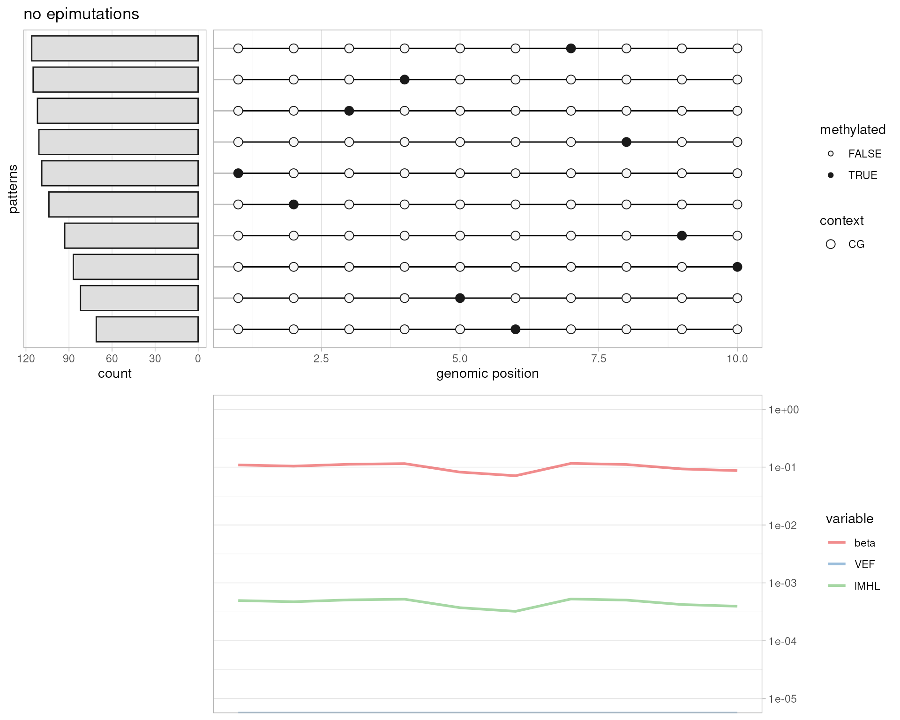

``` r


# one complete epimutation
simulateBam(
  output.bam.file=out.bam,
  XM=c(
    paste(rep("Z", 10), collapse=""),
    sapply(
      lapply(1:999, function (x) sample(c("Z",rep("z", 9)), 10)),
      paste, collapse=""
    )
  ),
  XG="CT"
)
#> Writing sample BAM [0.105s]
#> [1] 1000
plotMetrics(out.bam, as("chrS:1-10", "GRanges"), title="one complete epimutation")
```


``` r


# one partial epimutation
simulateBam(
  output.bam.file=out.bam,
  XM=c(
    paste(c(rep("Z", 4), "z", "z", rep("Z", 4)), collapse=""),
    sapply(
      lapply(1:999, function (x) sample(c("Z",rep("z", 9)), 10)),
      paste, collapse=""
    )
  ),
  XG="CT"
)
#> Writing sample BAM [0.105s]
#> [1] 1000
plotMetrics(out.bam, as("chrS:1-10", "GRanges"), title="one partial epimutation")
```

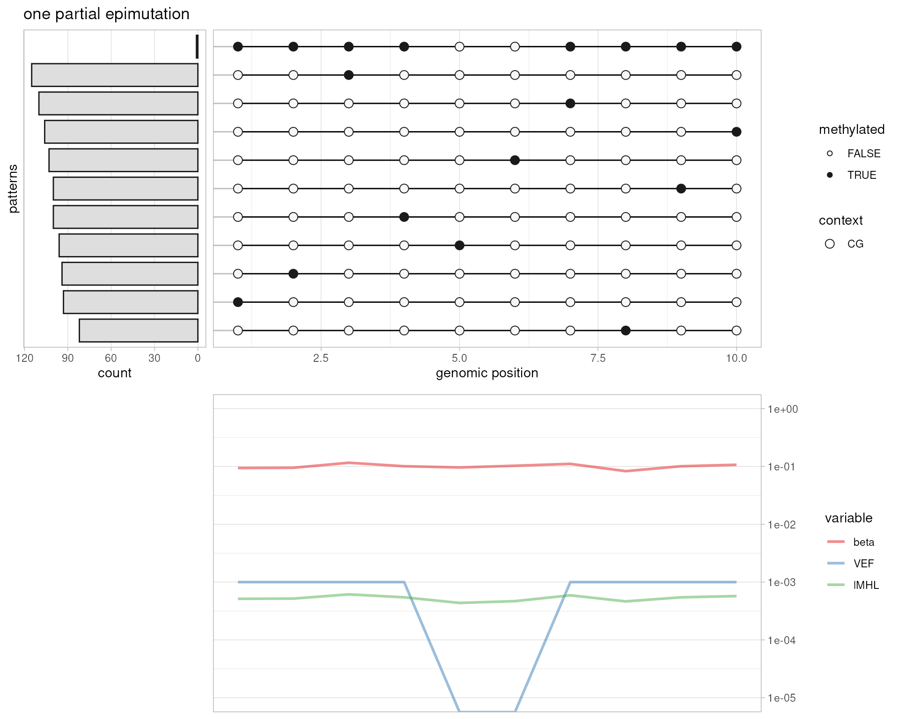

``` r


# another partial epimutation
simulateBam(
  output.bam.file=out.bam,
  XM=c(
    "zZZZZZZZzz",
    sapply(
      lapply(1:999, function (x) sample(c("Z",rep("z", 9)), 10)),
      paste, collapse=""
    )
  ),
  XG="CT"
)
#> Writing sample BAM [0.147s]
#> [1] 1000
plotMetrics(out.bam, as("chrS:1-10", "GRanges"), title="another partial epimutation")
```

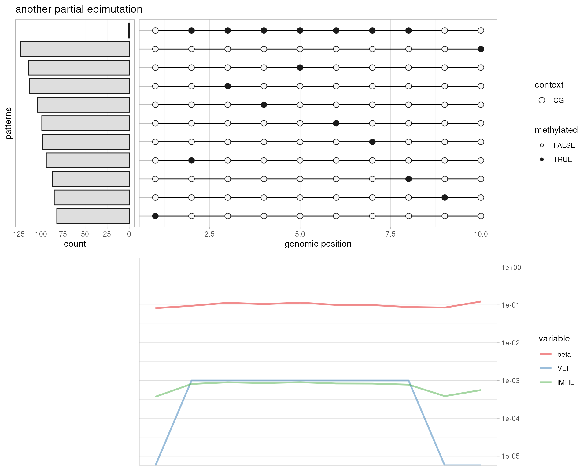

``` r


# several partial epimutations
simulateBam(
  output.bam.file=out.bam,
  XM=c(
    sapply(
      lapply(1:10, function (x) c(rep("Z", 6), rep("z", 4))),
      paste, collapse=""
    ),
    sapply(
      lapply(1:999, function (x) sample(c("Z",rep("z", 9)), 10)),
      paste, collapse=""
    )
  ),
  XG="CT"
)
#> Writing sample BAM [0.111s]
#> [1] 1009
plotMetrics(out.bam, as("chrS:1-10", "GRanges"), title="several partial epimutations")
```

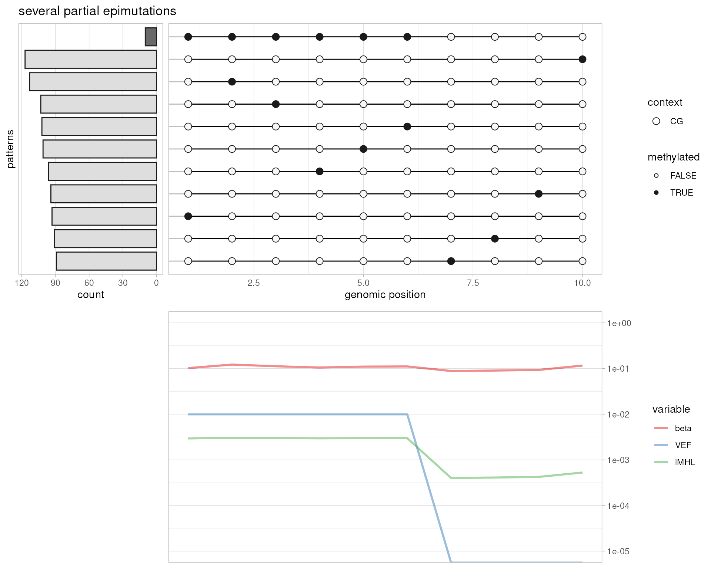

``` r


# several short partial epimutations
simulateBam(
  output.bam.file=out.bam,
  XM=c(
    sapply(
      lapply(1:10, function (x) c(rep("Z", 4), rep("z", 6))),
      paste, collapse=""
    ),
    sapply(
      lapply(1:999, function (x) sample(c("Z",rep("z", 9)), 10)),
      paste, collapse=""
    )
  ),
  XG="CT"
)
#> Writing sample BAM [0.104s]
#> [1] 1009
plotMetrics(out.bam, as("chrS:1-10", "GRanges"), title="several short partial epimutations")
```

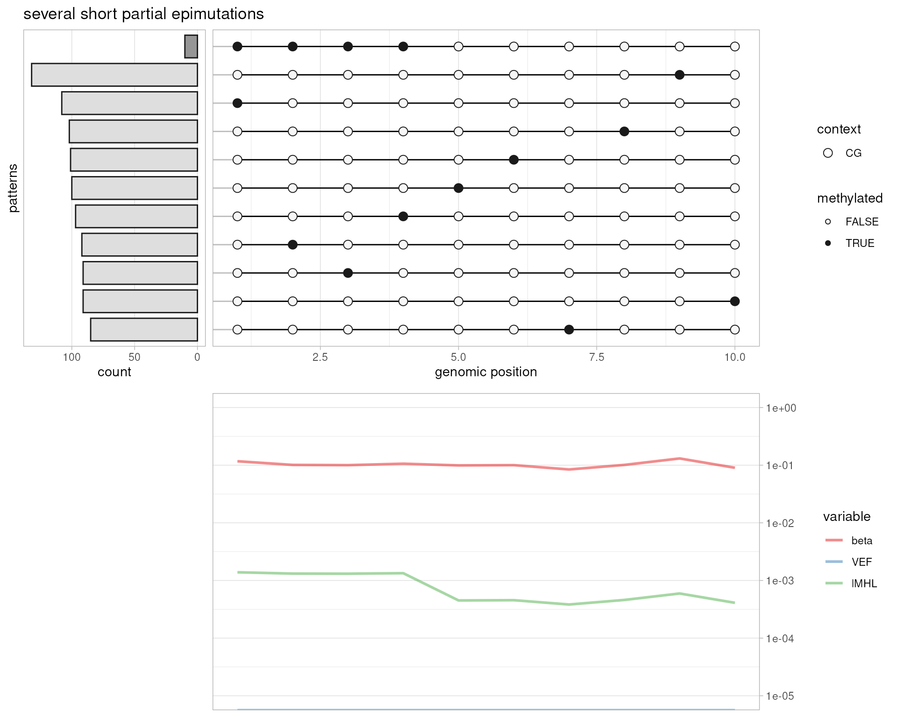

``` r


# several overlapping partial epimutations
simulateBam(
  output.bam.file=out.bam,
  pos=1:10,
  XM=c(
    "ZZZZZZZZZZ", "ZZZZZZZZZz", "ZZZZZZZZzz", "ZZZZZZZzzz", "ZZZZZZzzzz",
    sapply(
      lapply(1:15, function (x) sample(c("Z",rep("z", 9)), 10)),
      paste, collapse=""
    )
  ),
  XG="CT"
)
#> Writing sample BAM [0.005s]
#> [1] 20
plotMetrics(out.bam, as("chrS:1-20", "GRanges"), title="several overlapping partial epimutations")
```

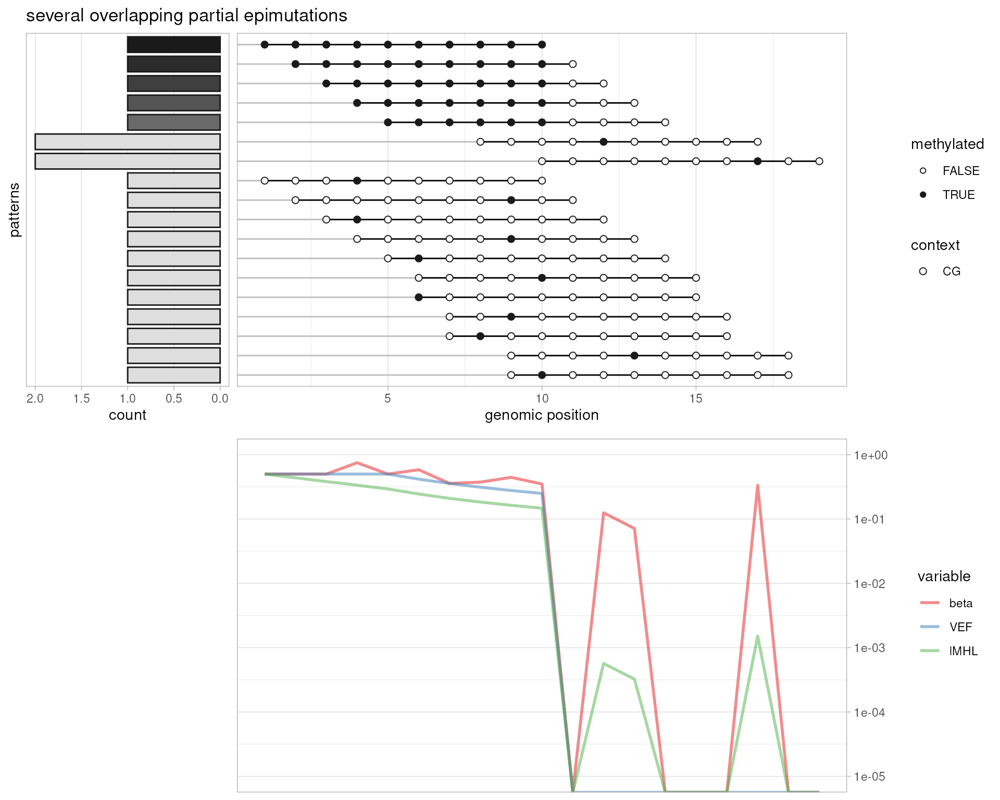

``` r


# simulated long-read sequencing, low methylation
getXM <- function (p) {sample(x=c("z", "Z"), size=1, prob=c(p, 1-p))}
probs <- (sin(seq(-2*pi, +1*pi, by = pi/25))+2)/3
simulateBam(
  output.bam.file=out.bam,
  pos=1:10,
  XM=sapply(1:10, function (i) {paste(sapply(probs, getXM), collapse="")}),
  XG="CT"
)
#> Writing sample BAM [0.012s]
#> [1] 10
plotMetrics(out.bam, as("chrS:1-1000", "GRanges"), title="simulated long-read sequencing, low methylation")
```

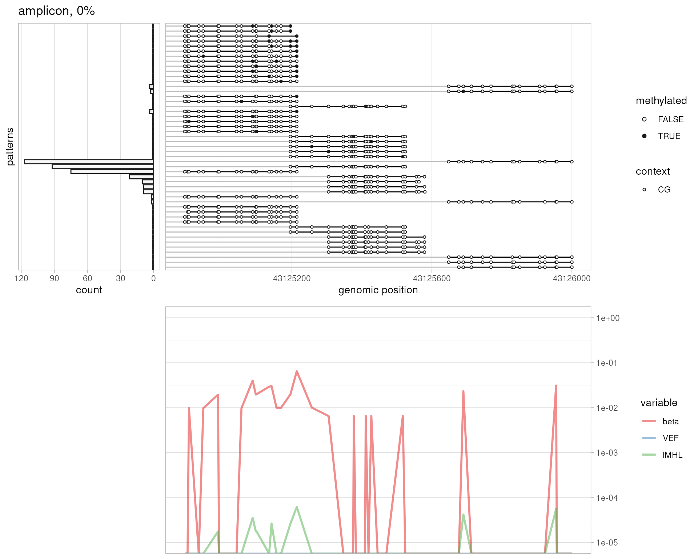

``` r


# simulated long-read sequencing, high methylation
simulateBam(
  output.bam.file=out.bam,
  pos=1:10,
  XM=sapply(1:10, function (i) {paste(sapply(1-probs, getXM), collapse="")}),
  XG="CT"
)
#> Writing sample BAM [0.010s]
#> [1] 10
plotMetrics(out.bam, as("chrS:1-1000", "GRanges"), title="simulated long-read sequencing, high methylation")
```

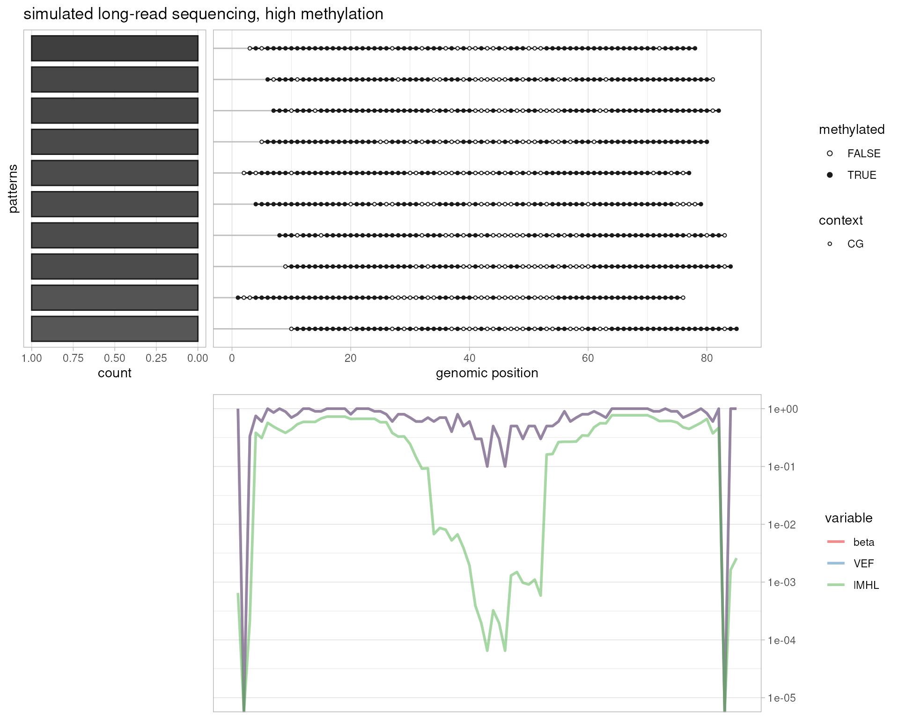

``` r


# amplicon 0%
plotMetrics(
  system.file("extdata", "amplicon000meth.bam", package="epialleleR"),
  as("chr17:43124861-43126026", "GRanges"), title="amplicon, 0%"
)
```

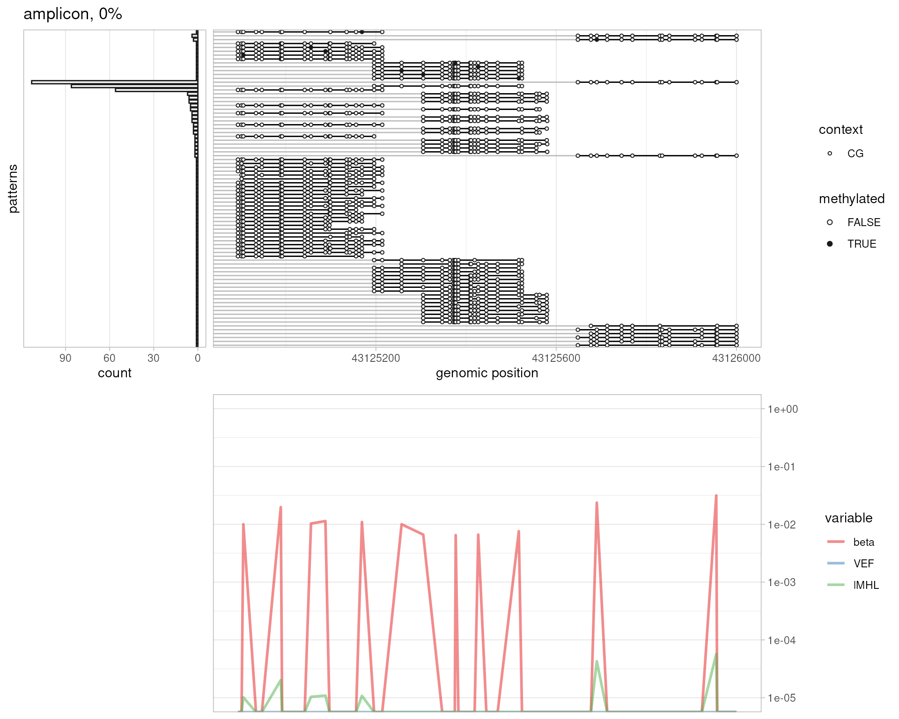

``` r


# amplicon 10%
plotMetrics(
  system.file("extdata", "amplicon010meth.bam", package="epialleleR"),
  as("chr17:43124861-43126026", "GRanges"), title="amplicon, 10%"
)
```

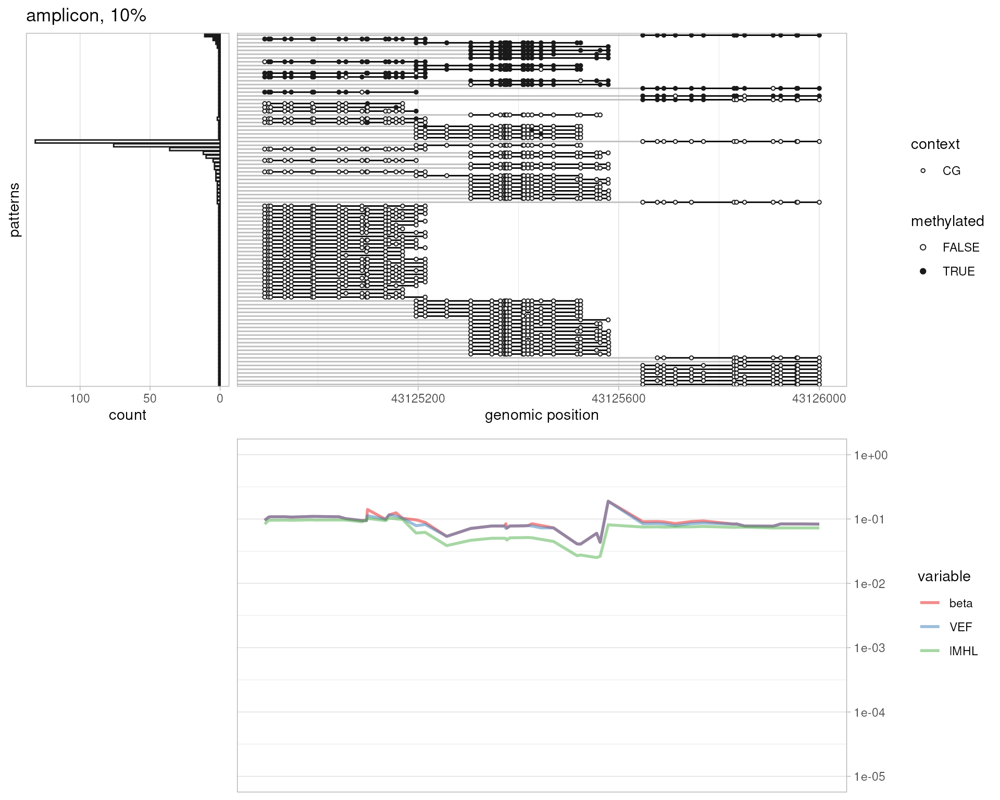

``` r


# sample capture, BMP7
plotMetrics(
  system.file("extdata", "capture.bam", package="epialleleR"),
  as("chr20:57266125-57268185:+", "GRanges"), title="sample capture, BMP7, + strand"
)
```

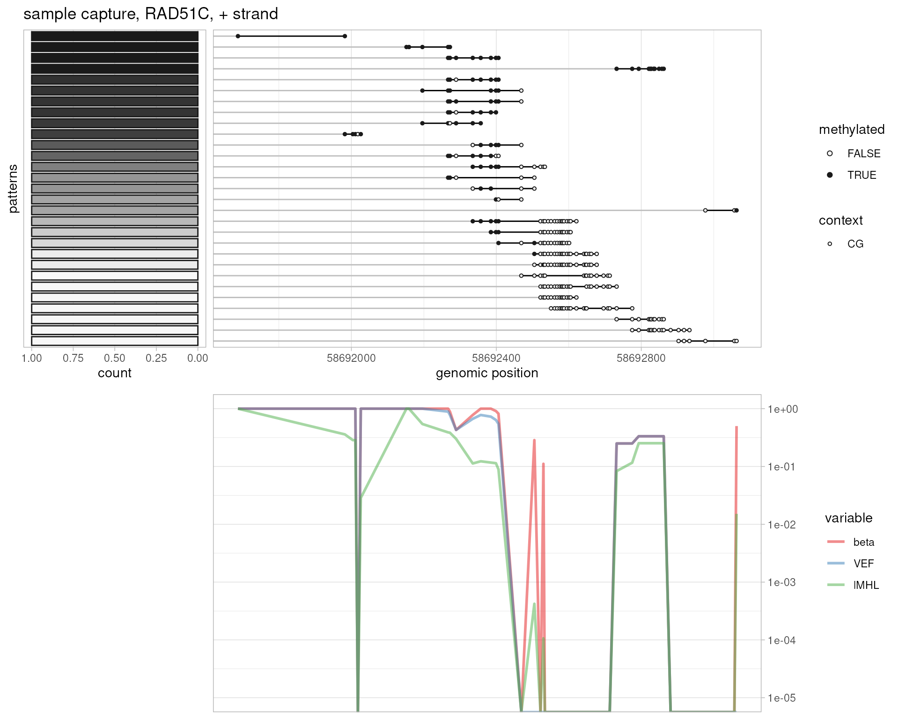

``` r


# sample capture, BMP7
plotMetrics(
  system.file("extdata", "capture.bam", package="epialleleR"),
  as("chr20:57266125-57268185:-", "GRanges"), title="sample capture, BMP7, - strand"
)
```

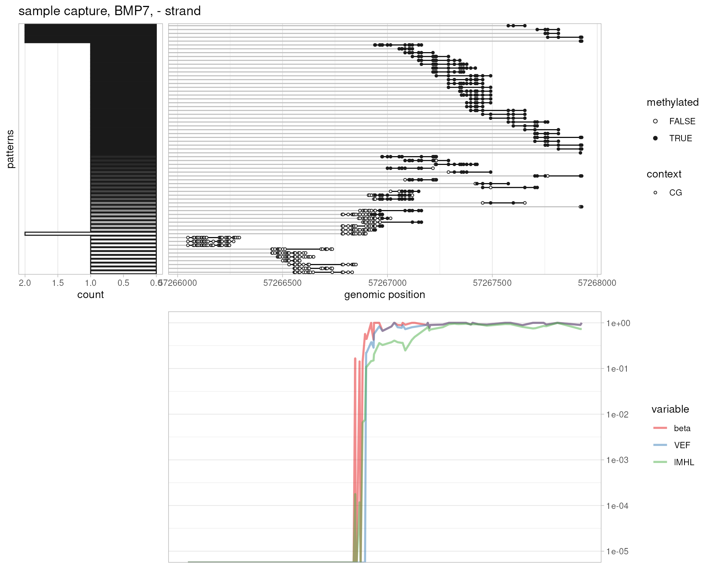

``` r


# sample capture, RAD51C
plotMetrics(
  system.file("extdata", "capture.bam", package="epialleleR"),
  as("chr17:58691673-58693108:+", "GRanges"), title="sample capture, RAD51C, + strand"
)
```

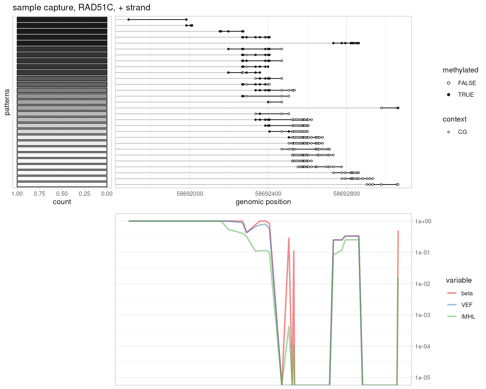

``` r


# sample capture, RAD51C
plotMetrics(
  system.file("extdata", "capture.bam", package="epialleleR"),
  as("chr17:58691673-58693108:-", "GRanges"), title="sample capture, RAD51C, - strand"
)
```

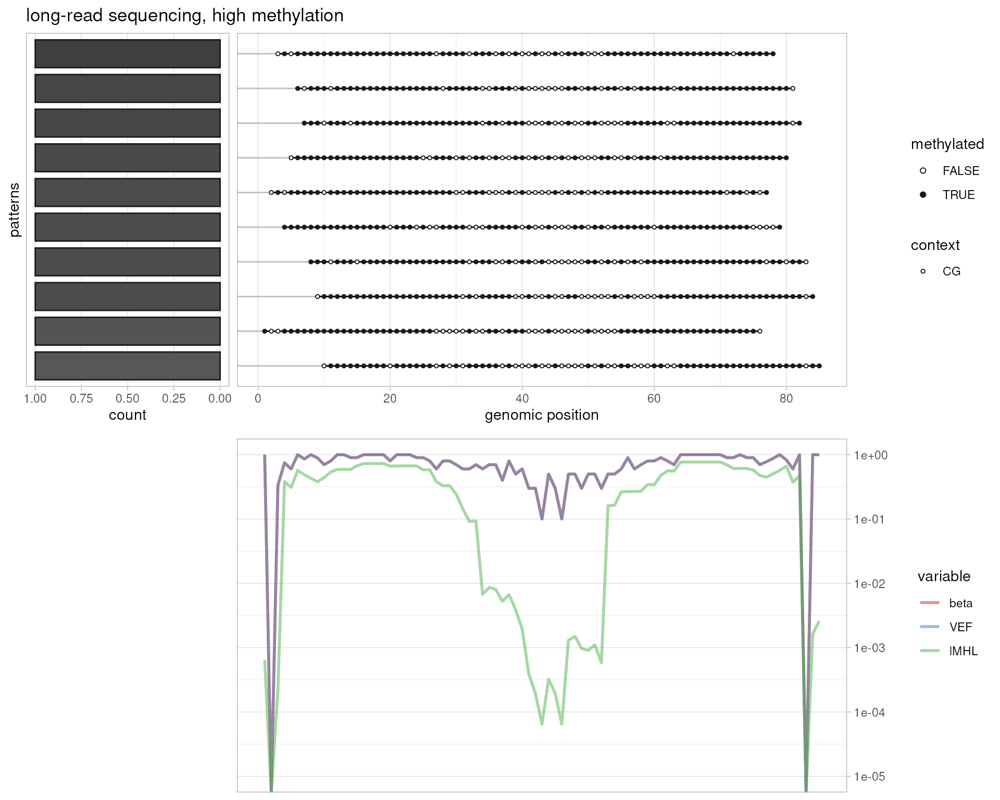

``` r


# long-read sequencing, BRCA1
plotMetrics(
  system.file("extdata", "longread.bam", package="epialleleR"),
  as("chr17:43125000-43127000:+", "GRanges"), title="long-read sequencing, BRCA1, + strand", clip.to.targets=TRUE
)
```

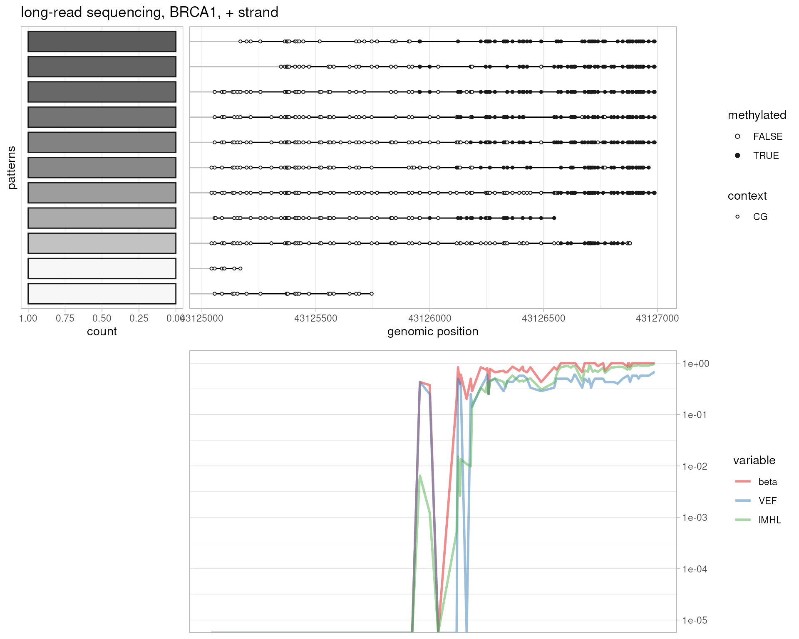

``` r


# long-read sequencing, BRCA1
plotMetrics(
  system.file("extdata", "longread.bam", package="epialleleR"),
  as("chr17:43125000-43127000:-", "GRanges"), title="long-read sequencing, BRCA1, - strand", clip.to.targets=TRUE
)
```

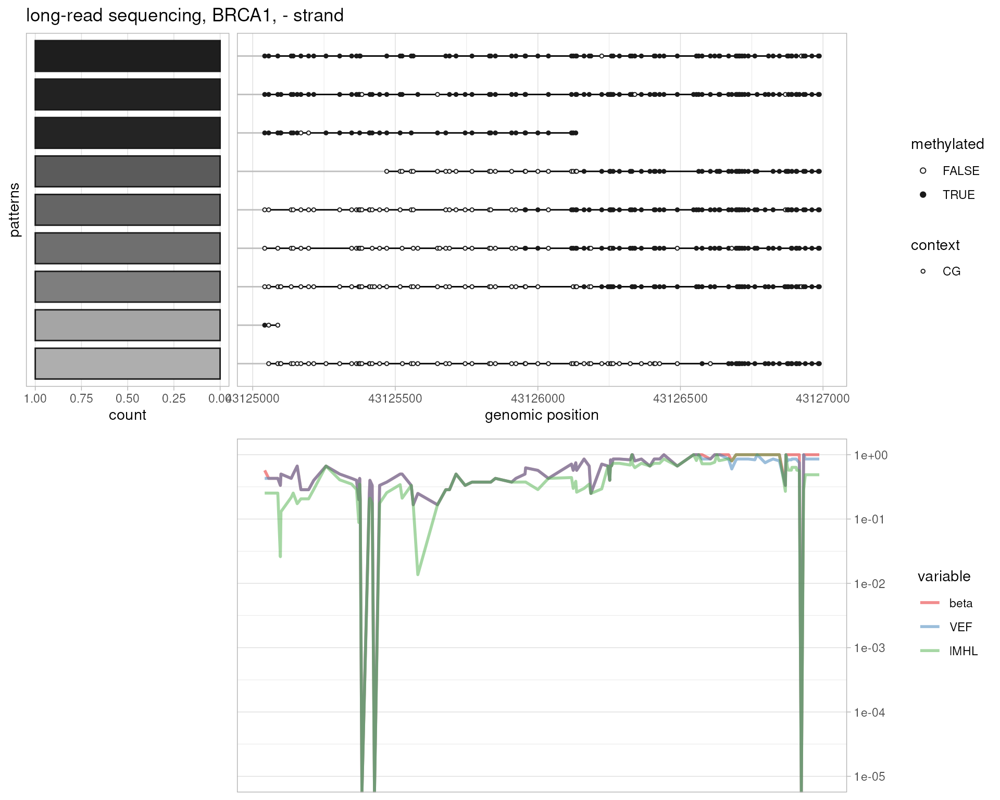

### Session Info

``` r

sessionInfo()
#> R Under development (unstable) (2026-01-22 r89323)
#> Platform: x86_64-pc-linux-gnu
#> Running under: Ubuntu 24.04.3 LTS
#> 
#> Matrix products: default
#> BLAS:   /usr/lib/x86_64-linux-gnu/openblas-pthread/libblas.so.3 
#> LAPACK: /usr/lib/x86_64-linux-gnu/openblas-pthread/libopenblasp-r0.3.26.so;  LAPACK version 3.12.0
#> 
#> locale:
#>  [1] LC_CTYPE=en_US.UTF-8       LC_NUMERIC=C               LC_TIME=en_US.UTF-8       
#>  [4] LC_COLLATE=en_US.UTF-8     LC_MONETARY=en_US.UTF-8    LC_MESSAGES=en_US.UTF-8   
#>  [7] LC_PAPER=en_US.UTF-8       LC_NAME=C                  LC_ADDRESS=C              
#> [10] LC_TELEPHONE=C             LC_MEASUREMENT=en_US.UTF-8 LC_IDENTIFICATION=C       
#> 
#> time zone: UTC
#> tzcode source: system (glibc)
#> 
#> attached base packages:
#> [1] stats4    stats     graphics  grDevices utils     datasets  methods   base     
#> 
#> other attached packages:
#> [1] epialleleR_1.19.3    ggplot2_4.0.1        GenomicRanges_1.63.1 Seqinfo_1.1.0       
#> [5] IRanges_2.45.0       S4Vectors_0.49.0     BiocGenerics_0.57.0  generics_0.1.4      
#> [9] data.table_1.18.0   
#> 
#> loaded via a namespace (and not attached):
#>  [1] gtable_0.3.6       jsonlite_2.0.0     dplyr_1.1.4        compiler_4.6.0     Rcpp_1.1.1        
#>  [6] tidyselect_1.2.1   jquerylib_0.1.4    systemfonts_1.3.1  scales_1.4.0       textshaping_1.0.4 
#> [11] yaml_2.3.12        fastmap_1.2.0      R6_2.6.1           labeling_0.4.3     knitr_1.51        
#> [16] htmlwidgets_1.6.4  tibble_3.3.1       desc_1.4.3         pillar_1.11.1      bslib_0.9.0       
#> [21] RColorBrewer_1.1-3 rlang_1.1.7        cachem_1.1.0       xfun_0.56          fs_1.6.6          
#> [26] sass_0.4.10        S7_0.2.1           otel_0.2.0         cli_3.6.5          withr_3.0.2       
#> [31] pkgdown_2.2.0.9000 magrittr_2.0.4     digest_0.6.39      grid_4.6.0         lifecycle_1.0.5   
#> [36] vctrs_0.7.1        evaluate_1.0.5     glue_1.8.0         farver_2.1.2       ragg_1.5.0        
#> [41] rmarkdown_2.30     pkgconfig_2.0.3    tools_4.6.0        htmltools_0.5.9
```
